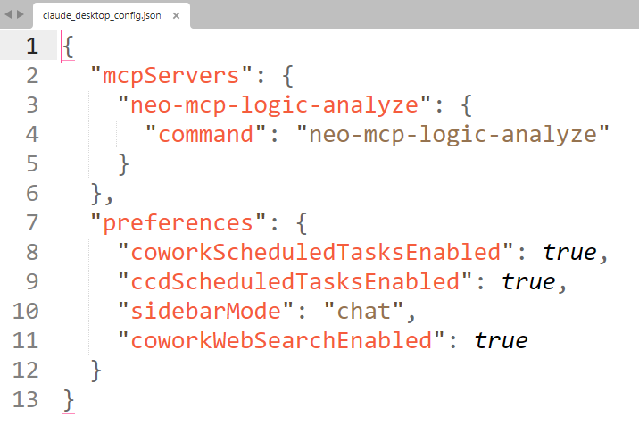
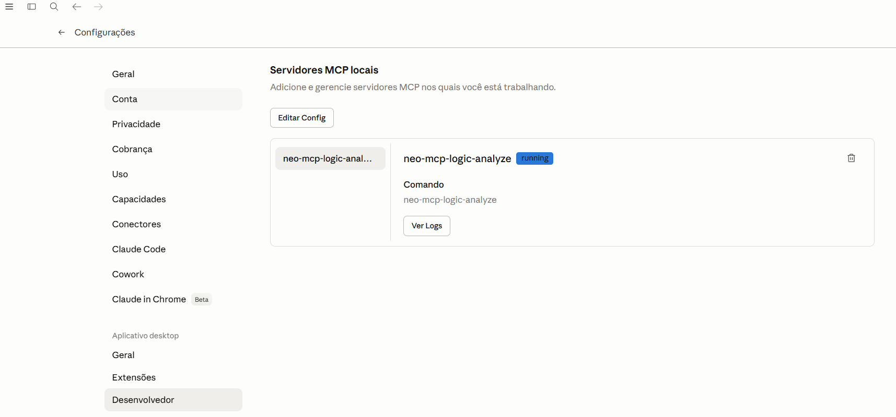
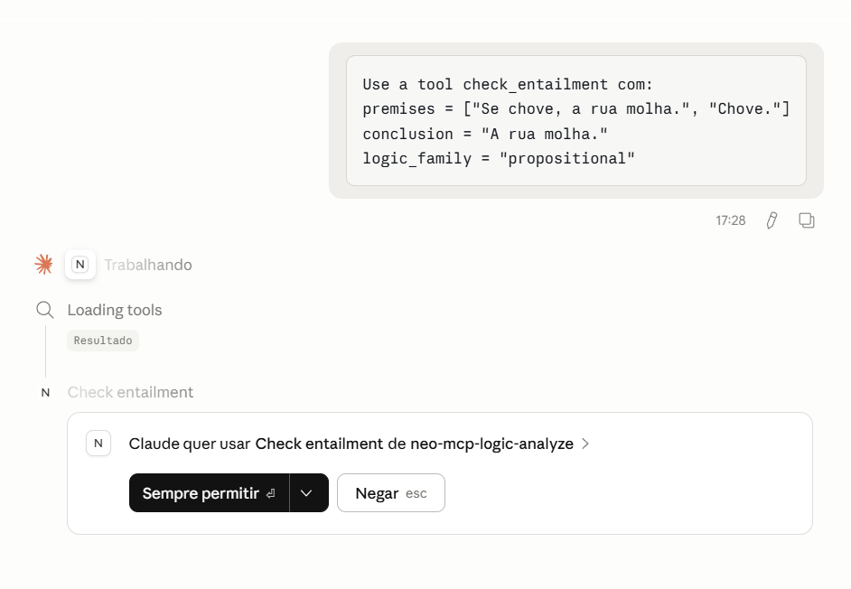
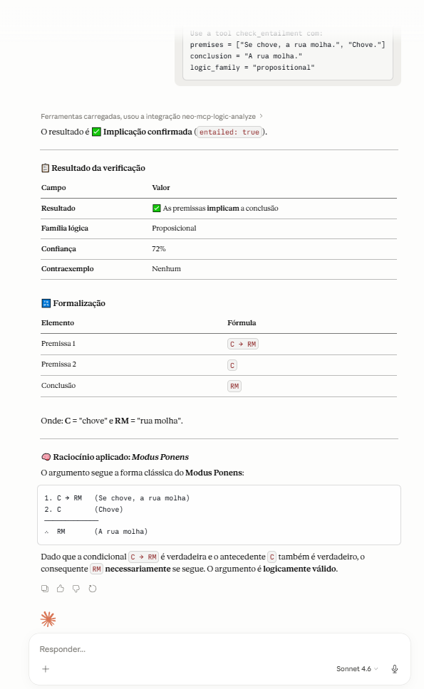

# neo-mcp-logic-analyze

Servidor MCP em Python para analisar enunciados em linguagem natural e produzir uma formalização lógica controlada, com foco didático e auditável.

## O que este serviço faz

- formaliza textos curtos em lógica proposicional;
- formaliza um fragmento controlado de lógica de primeira ordem;
- detecta ambiguidades relevantes para formalização;
- verifica consistência e consequência lógica;
- produz contraexemplos simples e explicações em linguagem natural.

## Ferramentas MCP expostas

- `nl_parse_logic`
- `detect_ambiguities`
- `check_consistency`
- `check_entailment`
- `find_counterexample`
- `explain_formalization`
- `normalize_argument`

## Instalação

Para fazer o download dos binários e instalar no ambiente python local

```powershell
git clone https://github.com/giseldo/neo-mcp-logic-analyze
cd neo-mcp-logic-analyze
python -m pip install -e .
```

## Execução rápida

Para verificar se está tudo funcionando

```powershell
neo-mcp-logic-analyze
```

## Como desinstalar

Se você instalou este app com `pip install -e .` ou `pip install .`, remova com:

```powershell
pip uninstall neo-mcp-logic-analyze
```

## Configuração do MCP no claude code ou no cursor

Exemplo de configuração para clientes MCP (chave `mcpServers`), após instalar o projeto com `pip install -e .`:

```json
{
	"mcpServers": {
		"neo-mcp-logic-analyze": {
			"command": "neo-mcp-logic-analyze"
		}
	}
}
```

## Exemplos de teste

Use um destes exemplos no seu harness (exemplo: claude desktop ou cursor)

### Consequência lógica proposicional

```text
Use a tool check_entailment com:
premises = ["Se chove, a rua molha.", "Chove."]
conclusion = "A rua molha."
logic_family = "propositional"
```

### Formalização em FOL

```text
Use a tool nl_parse_logic com:
text = "Todo aluno estuda."
logic_family = "fol"
return_alternatives = true
```

### Ambiguidade

```text
Use a tool detect_ambiguities no texto:
"Todo aluno leu um livro."
```

### Inconsistência

```text
Use a tool check_consistency com:
premises = ["Todo professor pesquisa.", "Nenhum professor pesquisa."]
logic_family = "fol"
```

## Estrutura principal

- [server.py](src/mcp_logic_analyzer/server.py): exposição MCP de tools, resources e prompts
- [schemas.py](src/mcp_logic_analyzer/models/schemas.py): contratos Pydantic
- [formalizer.py](src/mcp_logic_analyzer/services/formalizer.py): formalização controlada
- [entailment.py](src/mcp_logic_analyzer/services/entailment.py): consequência lógica e contraexemplos
- [consistency.py](src/mcp_logic_analyzer/services/consistency.py): consistência

## Limitações da V1

- a interpretação de linguagem natural é heurística e deliberadamente restrita;
- textos longos e muito ambíguos não são o foco desta versão;
- quando o texto é ambíguo, o servidor tenta devolver alertas e alternativas em vez de assumir uma única leitura.

## Exemplo no claude desktop

Se tudo estiver correto no claude desktop ele irá verificar com o usuário liberação para acesso ao MCP

### Configuração





### Exemplo de uso



Depois ele trará a resposta se for dada a permissão


